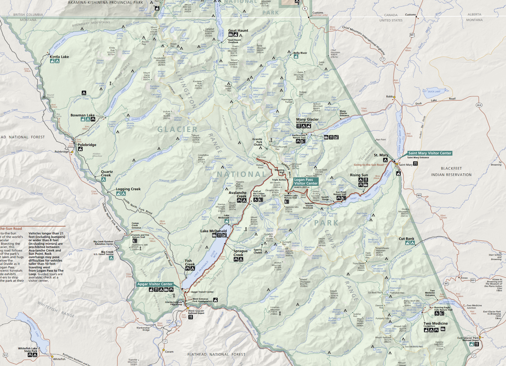
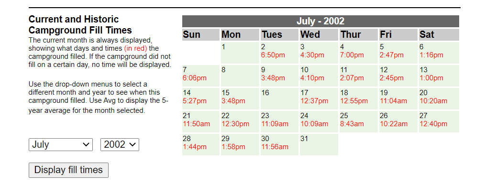
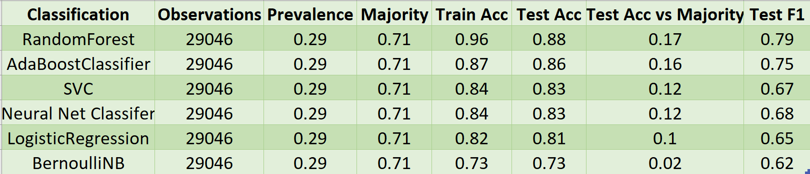
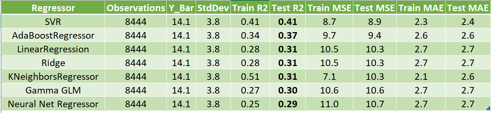
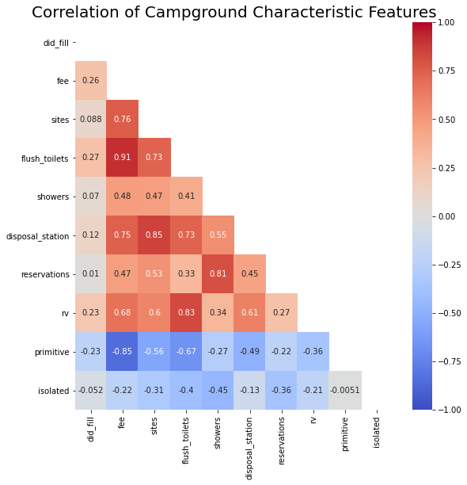

# Modeling Campground Demand at Glacier National Park
___
[Zach Tretter](https://www.linkedin.com/in/zachtretter/)

June 2020

General Assembly Data Science Immersive Capstone

Boston, MA

-------------

### Problem Statement - Predict if and when a campground at Glacier National Park will up
--------

Glacier National Park, located in Northwest Montana, straddles the Continental Divide.  There are 13 distinct campgrounds within the park boundaries.  Unique to GNP (Glacier National Park) is the 'Campground Status' [webpage](https://www.nps.gov/applications/glac/cgstatus/cgstatus.cfm) that enables anyone to view the current and historic fill times.  

Official Park Map [link to pdf](http://npmaps.com/wp-content/uploads/glacier-map.pdf)

Example - Many Glacier Campground for July 2002

This dataset provides a classification problem, a regression problem, and a time series problem.

* Classification - Will a campground fill up on a given day?
* Prediction - For those that do fill, what time of day will this occur?
* Time Series - Can prior times predict future times?

***
## Principal Findings

The models documented can explain some of the variation in daily campground demand at Glacier National Park.  Factors thought to influence real time campground demand not available in archived online data.  Specifically, detailed weather and air quality data by park area. For classification, predicting if a campground fills up, most variation explained by time factors: seasonal variation (high season July/August) and year-over-year increase in visitation.  I hypothesize also that the popularity of campgrounds can be self-perpetuating.  For regression, predicting when a campground fills, the models can explain less than half of the variance in fill time.  The Mean Absolute Error is ~2.5 hours for models but it remains unclear what’s true noise vs weak features.

Recommendations for Future Analysis
* Time Series modeling → main obstacle is discontinuity (e.g. days where a campground doesn’t fill)
* Incorporate archival text forecasts and archival air quality maps for more campground specific granularity

## Result Summary

* Classification Models are 10% to 20% Improvement over Baseline
* ADABoost is Best Model that is not Overfit

Units are in hours (e.g. 14.1 hours = 2:06 PM)

* Feature Set has Weak Explanatory Value in Predicting Fill Time
* Mean Absolute Error is ~2.5 hours (e.g. 2 hours, 30 mins)

***

## Project Methodology

Having been to GNP twice (14 nights total at campgrounds across 2016 and 2017) I approached the classification and prediction questions from the context of my own experiences in the park.  What motivated my day-to-day decision making in 2016 was weather.  Where will it be nice (i.e. sunny) and what hikes do I most want to do?  In 2017 however, weather was an afterthought due to the wildfire smoke.  Both weather and wildfires are phenomena that can be quantified, vary day by day, and drive camper behavior.

### Gathering the target data (Workbook 01)
The target data is fill times by campground by date.  Each observation (row in our dataframe) will be a unique combination of date and campground name.  There are 13 campgrounds and the GNP Campground Status Page has data for May to September dating back to the year 2000.  While the URL updates based on campground name, it does not update based on the year/month selected.  Thus requests.post was used to extract data from 13000 tables (13 campgrounds * 5 months * 20 years).

Of these 39K rows, there are ~8595 recorded fill times.  So the prevalence for our classification problem is at least 21%.

### Cleaning the Target Data (Workbook 02)
The raw csv file consists of 4 columns and 39,780 rows.  Each row is a unique combination of campground and date.  The 'fill time' exists as a string in the format of (example value) '02:15 PM'.  This was converted to hours after midnight as a float.  Thus "02:15 PM" becomes 14.25.  Other additional date formats were created (year, month as number, month as text, day of year, day of month, weekday) to facilitate EDA.

The raw data does not identify if a campground is open or not.  Thus dates where no fill time is recorded are not necessarily dates the campground did not fill up.  There are two sources of these false negatives.
* Campgrounds vary in their opening and closing dates (not all open from 1 May for 30 Sep)
  * Each season the park publishes a newsletter that states campground specific opening/closing dates.  However this document could only be found online going back 4 years.
  * Thus the earliest opening date for a campground is calculated as earlier of the earliest newsletter opening date and the earliest fill date.  Similarly for the latest date.
  * This excludes ~9000 observations

* Wildfires can close specific parts of the Park
  * Notable fires include the 2003 Roberts Fire and the 2018 Howe Ridge Fire.
  * For fires in 2015, 2017, and 2018, there are authorative news articles documenting which parts of the park were closed when amounting to 398 rows.
  * For the 2003 fire there weren't clear dates for opening/closing so the entire year was excluded.
    * [Graphic showing the extent of the 2003 fires](https://www.fs.usda.gov/Internet/FSE_DOCUMENTS/stelprd3850741.pdf)

Date specific engineered features include:
* "high_season" : 1 if Month is July or August, 0 otherwise
* 'weekend" : 1 if Friday or Saturday, 0 otherwise
* 'holiday' : 1 if date is, or is on either side of, Memorial Day, Independence Day, or Labor day

The thought for these variables is that demand will be greater in the peak summer months, on weekends, and on holidays.

GNP specific date features include:
* 'logan_pass': 1 if Logan Pass is open on that date, 0 otherwise.  Logan Pass is the highest point on Going to the Sun Road that bisects the park.  More people can access both sides of the park when this road is open.

### Weather Data (Workbook 03A)
There are four weather stations within Glacier National Park per the website for the NOAA Climate Data Office.  West Glacier, East Glacier, Many Glacier, and St Mary.  Unfortunately the only historic data available is air temperature and precipitation.  An effort was made to locate data on hours of sunlight or some quantification of "how good" the weather was that day beyond rain and temperature. Unfortunately that data was not readily available.

In the course of evaluating the weather data it was discovered there are missing dates

|    Station   | Missing Days |
|:------------:|:------------:|
| Many Glacier |       0      |
| West Glacier |      30      |
| East Glacier |      70      |
|   St. Mary   |      162     |

These were filled in my taking data from the next nearest weather station.  This approach is possible because there were no days were multiple stations were missing data.  Not all stations reported all data types.  Only TMAX, TMIN, PRCP, and SNOW existed across all 4 stations with enough regularity.  Missing values were filled in the from the next nearest station.

### Visitation Data (Workbook 03B)

Visitation at GNP has increased year over year.  While other date types (month, holiday, etc) repeat each year, the value of year itself is unique in each year.  Rather than assume a constant fixed increase in visitation each year, which is known to be incorrect, the total amount of park visitors by month is used.  This is the "baseline" demand in the park for campgrounds upon which all other variables seek to explain the day to day variation from.  Monthly visit data is for the entire park and is provided by the NPS [data webapge]( https://irma.nps.gov/STATS/Reports/Park/GLAC)

### Air Quality Data (Workbook 03C)
Much like weather data, air quality data is far more detailed real time than it is looking back.  There is only one Air Quality station near Glacier National Park.  Thus while every date can have a different AQI value, every campground has the same value for a given date.  Missing AQI values were interpolated.  AQI data is from [epa.gov](https://www.epa.gov/outdoor-air-quality-data/air-quality-index-daily-values-report)

### Campground Characteristics (Workbook 03D)
The 13 campgrounds differ in many ways.  There main features are listed on the [webpage](https://www.nps.gov/applications/glac/cgstatus/cgstatus.cfm) and were scraped.  The limitation here is that there isn't any clear way to get these values for prior years.  So the assumption is that they're the same for all years, which is no true.  But hopefully the number of sites and their important quality characteristic (running water or not) is unchanged.

### Dataframe Integration (Workbook 04)
The five source files (fill times, weather data, visit data, air quality data, and campground characteristics) were integrated into a single dataframe by the following steps

* Fill Times as foundation of [Final Dataframe](#Instantiate-final-df-as-df_fill)
* Left Join Dataframe with Air Quality on Date
  * Air Quality values are same for all campsites
* Left Join Dataframe with Monthly Visits on 'key_year_month'
  * 'key_year_month' is a text string of the form yyyy_mm
  * Visits are same for all campgrounds and all days in a month
* Left Join Dataframe with Campground Attributes on Campground name
  * Campground attributes don't vary by dates
* At this point we create a variable by combining date & nearest weather station to enable integration of the weather data
* Left Join Dataframe with Weather on 'date_wxstation'

### Exploratory Data Analysis (Workbook 05)
Examine correlation between within each feature grouping and with the target variables.  The only feature group with problematic multicollinearity is the campground features.  There are only 13 campgrounds and even more possible characteristics.

The goal is not to dummify campgrounds by name but rather group them by characteristic.  Thus the only 3 traits used in modeling are
* Number of Sites (Integer)
* Primitive (Boolean)
* Showers (Boolean)

### Modeling (Workbook 06)

Multiple models of each type were evaluated.  For classification, the metric was improvement over the baseline majority class.  For regression, the metric was R2.

The set of available features is

|     Features     |       Grouping       | Data Type |                           Description                          | Used in Model | Variation Across Time | Variation across Campground |
|:----------------:|:--------------------:|:---------:|:--------------------------------------------------------------:|:-------------:|:---------------------:|:---------------------------:|
|    high_season   |         Date         |  Boolean  |                   1 if July or August, else 0                  |       x       |        Monthly        |             None            |
|      weekend     |         Date         |  Boolean  |                     1 if Fri or Sat, else 0                    |       x       |         Weekly        |             None            |
|      holiday     |         Date         |  Boolean  |                      1 if holiday, else 0                      |       x       |         Daily         |             None            |
|    logan_pass    |         Date         |  Boolean  |                 1 if Logan's pass open, else 0                 |       x       |         Daily         |             None            |
|        aqi       |      Air Quality     |    Int    |                    Air Quality Index by date                   |       x       |         Daily         |             None            |
|       ozone      |      Air Quality     |    Int    |                 daily avg concetration of ozone                |       x       |         Daily         |             None            |
|       PM10       |      Air Quality     |    Int    |  daily avg concentration particulate matter smaller than 10 mm |       x       |         Daily         |             None            |
|       PM25       |      Air Quality     |    Int    | daily avg concentration particulate matter smaller than 2.5 mm |       x       |         Daily         |             None            |
|      visits      |        Unique        |    Int    |                 Monthly visitors to GNP by year                |       x       |        Monthly        |             None            |
|        fee       | Campground Attribute |    Int    |             Total supply of other campground sites             |               |          None         |             Yes             |
|       sites      | Campground Attribute |    Int    |                  Number of sites at campground                 |       x       |          None         |             Yes             |
|   flush_toilets  | Campground Attribute |  Boolean  |                1 if campground has flush toilets               |               |          None         |             Yes             |
|      showers     | Campground Attribute |  Boolean  |                   1 if campground has showers                  |       x       |          None         |             Yes             |
| disposal_station | Campground Attribute |  Boolean  |              1 if campground has disposal stations             |               |          None         |             Yes             |
|   reservations   | Campground Attribute |  Boolean  |               1 if campground takes reservations               |               |          None         |             Yes             |
|        rv        | Campground Attribute |  Boolean  |                   1 if campground allows RVs                   |               |          None         |             Yes             |
|     primitive    | Campground Attribute |  Boolean  |                  1 if campground is primitive                  |       x       |          None         |             Yes             |
|     isolated     | Campground Attribute |  Boolean  |       1 if campground is isolated (none others close by)       |               |          None         |             Yes             |
|     cg_supply    |        Unique        |    Int    |             Total supply of other campground sites             |       x       |         Daily         |             None            |
|       PRCP       |        Weather       |   Float   |                  Daily precipitation (inches)                  |       x       |         Daily         |           Partial           |
|       SNOW       |        Weather       |   Float   |                     Daily snowfall (inches)                    |       x       |         Daily         |           Partial           |
|       TMAX       |        Weather       |    Int    |                      Daily temperature max                     |       x       |         Daily         |           Partial           |
|       TMIN       |        Weather       |    Int    |                      Daily temperature min                     |       x       |         Daily         |           Partial           |
|     did_PRCP     |        Weather       |  Boolean  |                       1 if rained on date                      |       x       |         Daily         |           Partial           |
|     did_Snow     |        Weather       |  Boolean  |                       1 if snowed on date                      |       x       |         Daily         |           Partial           |

***

## File Structure of CODE Folder

Coding was split amongst several workbooks to discretize the workflow and enable exploration and cleaning of each data source

|              File   Name             |                Input Files                |             Output File             |
|:------------------------------------:|:-----------------------------------------:|:-----------------------------------:|
| 01_webscrape_GNP_fill_data.ipynb     |              None (Webscrape)             |         01_filltimes_raw.csv        |
| 02_clean_target_data.ipynb           |            01_filltimes_raw.csv           |        02_filltimes_clean.csv       |
| 03a_weather_data.ipynb               |       raw_weather_data_NOAA_CDO.csv       |        03a_weather_clean.csv        |
| 03b_monthly_visits.ipynb             |    raw_visitors_by_month_NPS_STATS.csv    |     03b_monthly_visits_clean.csv    |
| 03c_air_quality.ipynb                |           AQI_CSVs' (x20 files)           |      03c_air_quality_clean.csv      |
| 03d_campground_characteristics.ipynb |              None (Webscrape)             | 03d_campground_attributes_clean.csv |
| 04_integrate_dataframes.ipynb        | All files ending in _clean.csv (x5 total) |        04_Full_DataFrame.csv        |
| 05_EDA.ipynb                         |           04_Full_DataFrame.csv           |                 N/A                 |
| 06_Modeling.ipynb                    |           04_Full_DataFrame.csv           |                 N/A                 |
